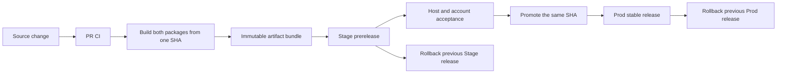

# Onward plugin packages

This file is the working contract for the standalone plugin distribution
workspace. It describes what this repository is allowed to contain, how the
two environment packages must behave, and how a tested source revision becomes
a distributable release.

## Mission

This workspace produces and distributes two installable MCP packages from one
source definition:

- onward-stage points to the hosted Stage resource
- onward-prod points to the hosted Prod resource

The packages are a thin distribution layer. They contain manifests, MCP
connection metadata, compatibility files, and public environment metadata.
They do not contain the Onward backend, database migrations, provider secrets,
or an alternative authentication system.

The workspace must remain independently understandable and releasable. A
consumer should be able to obtain a package from the GitHub distribution
repository without access to the private Onward application repository.

## Product ideology

### One product, explicit environments

Stage and Prod implement the same Onward product contract, but they are two
different resources. Their package names, versions, resource URLs,
authorization-server metadata URLs, and OAuth registrations remain explicit
and separate.

Never add a runtime environment switch that makes one installed package choose
between Stage and Prod. Selecting the environment happens by installing the
corresponding package.

### Distribution is not authentication

GitHub distributes manifests and generated artifacts. It never grants access
to Onward data. Runtime access is established through the hosted OAuth flow.

Do not put access tokens, refresh tokens, client secrets, service-role keys,
PATs, authorization codes, or M2M credentials in source, generated files,
release assets, logs, screenshots, examples, or tests.

The current product boundary is interactive OAuth authorization code with PKCE.
PAT, client credentials, custom OAuth scopes, and unattended machine-to-machine
access are not part of this workspace unless a separate architecture decision
changes that boundary.

### Least privilege and owner scope

The MCP resource derives the owner from the verified bearer token. Package
configuration must never accept or encode a user ID, email address, tenant ID,
or owner override.

The package exposes only the capabilities implemented and authorized by the
Onward MCP resource. Current task, Subtask, and Project operations are
owner-scoped and use the same backend contracts as the web UI.

### Promotion instead of drift

Stage is the acceptance channel. Prod is promoted only from a source revision
and artifact bundle that passed Stage acceptance.

The release process must preserve provenance:

- source commit SHA
- package versions
- environment and resource URL
- generated artifact hashes
- acceptance and promotion status

Do not rebuild Prod from a later moving branch after Stage has passed.

### Portable core, compatibility edges

The portable root manifests are canonical:

- plugin.json
- mcp.json

Host-specific files are generated compatibility edges. They must describe the
same server, environment, OAuth boundary, and package version as the portable
manifests. Do not hand-edit generated compatibility files to fix one host.
Change the shared source definition or the environment input, then rebuild and
test both packages.

### Public repository boundary

The public distribution repository is deliberately narrower than the private
Onward application repository. Keep private architecture notes, operational
credentials, internal account data, and unrelated application code outside
this workspace.

Public URLs and OAuth discovery URLs are configuration, not secrets. Their
presence does not replace authentication or authorization.

### Small, explicit surface

Prefer the smallest package and release mechanism that satisfies installation,
OAuth connection, environment isolation, update, and rollback. Do not add a
CLI, PAT fallback, local proxy, hidden telemetry, provider mutation, or
unrequested host-specific behavior.

## Technology surface

### Source of truth

The source structure is:

    config/environments/       public Stage and Prod inputs
    src/shared/                shared package contract
    src/package-definitions.mjs environment loading and package list
    scripts/build.mjs          deterministic generated output
    tests/                     structural and reproducibility checks
    docs/acceptance.md         static and hosted acceptance evidence

The build reads only checked-in source definitions. It must not read the
private Onward checkout, query Supabase, call Railway, register OAuth clients,
or mutate any provider state.

### Runtime connection

Each generated package points to one HTTPS hosted MCP resource using
streamable HTTP. The resource is Onward's authorization-protected MCP server.

The authorization server is the environment's Supabase Auth instance. The
resource server validates the OAuth bearer token and enforces owner scope.
Supabase discovery metadata and the resource URL must come from the same
environment input.

The current Supabase OAuth contract requests the standard openid scope. Do
not invent tasks:read or another custom scope in package metadata while the
authorization server does not support it.

### Package layout

The target GitHub repository layout is:

    .agents/plugins/marketplace.json
    .claude-plugin/marketplace.json
    plugins/onward-stage/
    plugins/onward-prod/
    config/
    src/
    scripts/
    tests/
    docs/
    .github/workflows/

The two plugin directories are generated release inputs. They must contain the
portable manifests and the compatibility files currently emitted by the
build:

    plugin.json
    mcp.json
    .codex-plugin/plugin.json
    .claude-plugin/plugin.json
    .mcp.json

The Codex and Claude Code catalogs are separate host-specific files generated
from the same package list. Each catalog may list both packages for an
internal or repository distribution. A public universal catalog should list
Prod only unless Stage is intentionally public. A prerelease label is not an
authorization boundary.

### Versioning

Use one release train for both environments:

    Stage: 0.1.2-stage.1
    Prod:  0.1.2

Stage versions are prereleases. Prod versions are stable versions. The package
identity is part of the contract, so do not reuse a Prod version for a package
that points to a different resource or issuer.

Git tags and GitHub releases must be immutable references to a source SHA.
Consumers should update from a release or pinned ref, never from an implicit
moving latest branch.

## GitHub release lifecycle

### Pull request

PR checks must run on Node.js 22 and verify:

- pnpm install --frozen-lockfile
- pnpm check
- valid portable and compatibility manifests
- deterministic repeated build
- different Stage and Prod endpoints and package identities
- no machine paths, credentials, or M2M configuration
- no cross-environment URL or issuer leakage
- marketplace catalog validity when the catalog changes

### Stage prerelease

After merge, the Stage workflow first verifies an exact 40-character SHA that
is an ancestor of protected main. Its read-only job builds both packages,
creates deterministic archives and uploads the artifact bundle. A separate
publish job with contents write can only publish that verified bundle as a
GitHub prerelease.

Acceptance must cover at least:

- fresh installation
- OAuth consent and callback
- existing-account sign-in
- tools/list
- owner-scoped task operations
- reconnect and token refresh
- Stage and Prod side-by-side installation
- cross-environment token separation

### Prod promotion

Prod promotion accepts a Stage tag, reads the source SHA from its release
manifest, resolves the actual tag commit, verifies that it is an ancestor of
protected main, and checks the exact Prod archive checksum. It does not rebuild
from the current branch. A separate publish job runs behind the `production`
environment and creates the stable Prod release only after the acceptance input
is exactly `accepted`. Configure required reviewers on that environment before
the first real promotion.

The release manifest must make it possible to answer which source revision,
package version, endpoint, issuer, and artifact hash reached Prod.

### Rollback

Rollback selects a previous immutable GitHub release and package artifact. Keep
at least the last known good Stage and Prod release available. GitHub package
rollback and Railway runtime rollback are separate operations and must not be
treated as interchangeable.

## Security and privacy rules

- Never commit secrets or realistic credentials
- Never log Authorization headers, tokens, OAuth codes, email addresses, task titles, or raw auth errors
- Never add a user-controlled owner, project, or environment override to package metadata
- Never use a public GitHub repository as an access-control mechanism
- Never make hosted OAuth, Supabase, Railway, or GitHub provider mutations from the build
- Keep Stage and Prod OAuth registrations and runtime data isolated
- Use peterpro-* only when a unique request or correlation identifier is required

## Development protocol

Before editing, inspect the existing source definition, generated output, tests,
and acceptance evidence. Keep changes surgical and preserve the existing
portable manifest contract.

After every code change:

    pnpm check

Run it under Node.js 22. For distribution or release changes also run:

    git diff --check

When adding a release or marketplace feature, add focused tests for the
invariant it introduces. Do not mark hosted acceptance as complete based only
on static package checks.

Do not commit, push, change GitHub visibility, create releases, or mutate
marketplace state without an explicit user request for that operation.

## Definition of done

A distribution change is complete only when:

- both packages build from the same source contract
- Stage and Prod remain explicitly isolated
- generated output is deterministic
- manifests pass structural validation
- no secrets or machine-specific paths are present
- release provenance is recorded
- the relevant host and OAuth acceptance evidence is recorded
- rollback remains possible through an immutable previous release

## Marketplace URL contract

The planned public distribution repository is:

    https://github.com/peterpro/onward-plugin

The host-specific marketplace catalogs are:

    .agents/plugins/marketplace.json
    .claude-plugin/marketplace.json

Stage and Prod are not separate marketplace file formats or runtime servers.
They are two pinned Git refs of the same repository, and each catalog at a
release ref points to the package directories in that same ref.

The canonical marketplace source is:

    https://github.com/peterpro/onward-plugin.git

The Codex catalog URL is:

    https://github.com/peterpro/onward-plugin/blob/main/.agents/plugins/marketplace.json

The Claude Code catalog URL is:

    https://github.com/peterpro/onward-plugin/blob/main/.claude-plugin/marketplace.json

The raw catalog URLs are useful for inspection:

    https://raw.githubusercontent.com/peterpro/onward-plugin/main/.agents/plugins/marketplace.json
    https://raw.githubusercontent.com/peterpro/onward-plugin/main/.claude-plugin/marketplace.json

For the example release train, the pinned marketplace sources are:

| Channel | Codex marketplace source | Claude Code marketplace source | Package path |
| --- | --- | --- | --- |
| Stage | https://github.com/peterpro/onward-plugin.git at ref v0.1.2-stage.1 | https://github.com/peterpro/onward-plugin.git#v0.1.2-stage.1 | ./plugins/onward-stage |
| Prod | https://github.com/peterpro/onward-plugin.git at ref v0.1.2 | https://github.com/peterpro/onward-plugin.git#v0.1.2 | ./plugins/onward-prod |

Use these commands when the repository and tags exist:

    codex plugin marketplace add https://github.com/peterpro/onward-plugin.git --ref v0.1.2-stage.1 --sparse .agents/plugins --sparse plugins
    claude plugin marketplace add https://github.com/peterpro/onward-plugin.git#v0.1.2-stage.1 --sparse .claude-plugin plugins

For Prod, use the same commands with ref v0.1.2. The catalog name is
onward-plugins, and the package names are onward-stage and onward-prod.

Human-readable release URLs are:

    Stage package: https://github.com/peterpro/onward-plugin/tree/v0.1.2-stage.1/plugins/onward-stage
    Stage release: https://github.com/peterpro/onward-plugin/releases/tag/v0.1.2-stage.1
    Prod package:  https://github.com/peterpro/onward-plugin/tree/v0.1.2/plugins/onward-prod
    Prod release:  https://github.com/peterpro/onward-plugin/releases/tag/v0.1.2

A release ref is required for an acceptance or production install. Do not use
main, a mutable latest URL, or a branch snapshot as a production package source.
The URL shape follows the official host documentation: Codex uses
.agents/plugins/marketplace.json and Claude Code uses
.claude-plugin/marketplace.json. Both hosts support Git-backed marketplace
sources pinned to a ref. See the [OpenAI plugin packaging documentation](https://developers.openai.com/plugins/build/plugins)
and the [Claude Code marketplace documentation](https://code.claude.com/docs/en/plugin-marketplaces).
